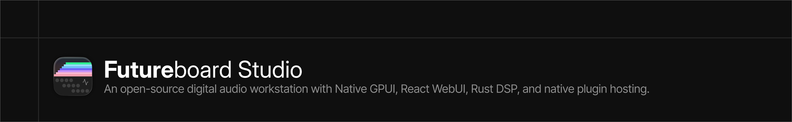
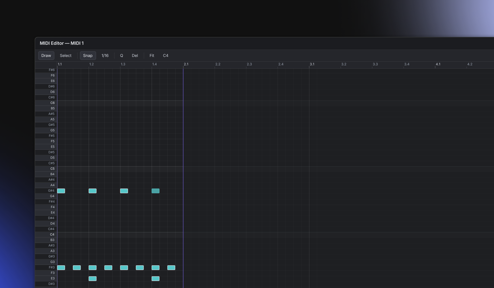
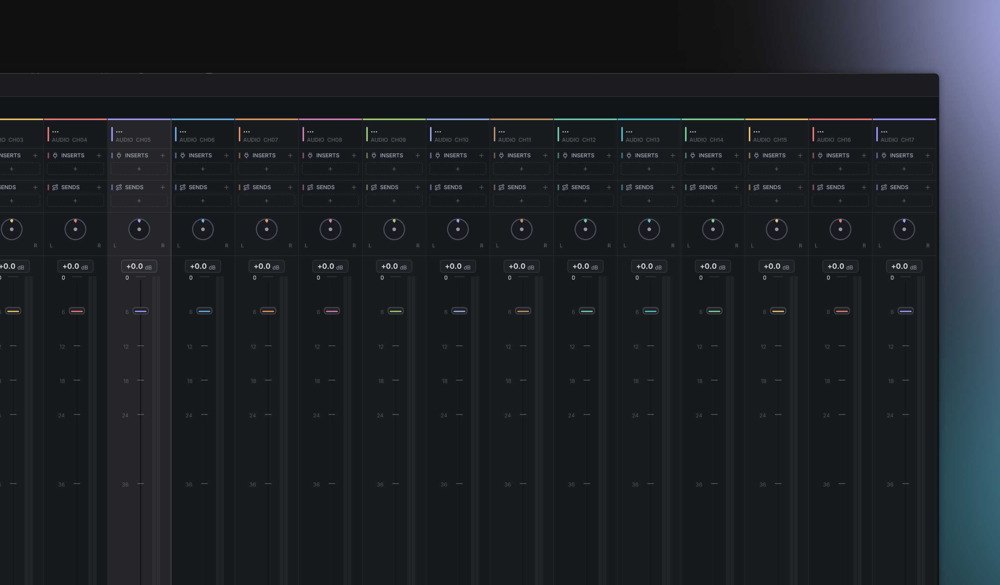
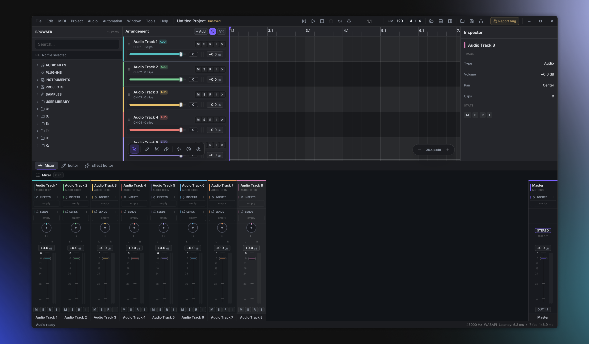

<div align="center">

<!-- Banner: HTML syntax -->



**A modern open-source Digital Audio Workstation built with Rust, GPUI, TypeScript, WebAssembly, and native audio/plugin infrastructure.**

<!-- Badges -->

[](https://github.com/futureboard/Futureboard/actions/workflows/ci.yml)
[](ARCHITECTURE.md)
[](LICENSE)
[](https://rustup.rs)
[](https://www.typescriptlang.org)
[](https://bun.sh)
[](https://webassembly.org)
[](https://www.gpui.rs)
[](https://steinbergmedia.github.io/vst3_dev_portal/)
[](https://cleveraudio.org)
[](#-getting-started)
[](CONTRIBUTING.md)

<br />

<!-- Banner: Markdown syntax alternative -->

<!--  -->

<br />
<br />

**Futureboard Studio** is currently in **pre-alpha**.
Expect rapid changes, experimental systems, unfinished workflows, and audio/plugin chaos with style.

[Architecture](#-architectural-overview) ·
[Getting Started](#-getting-started) ·
[Build](#-building-the-native-app) ·
[Debugging](#-debugging--diagnostics) ·
[Contributing](#-contributing)

</div>

---

## Preview

<!-- Image Grid: HTML syntax -->

<table>
  <tr>
    <td width="25%" align="center">
      
      <br />
      <sub>MIDI Editor</sub>
    </td>
    <td width="25%" align="center">
      
      <br />
      <sub>Mixer</sub>
    </td>
    <td width="25%" align="center">
      
      <br />
      <sub>Workspace</sub>
    </td>
  </tr>
</table>

<!-- Image Grid: Markdown syntax alternative -->

<!--
| Main Window | MIDI Editor | Mixer | Workspace |
| --- | --- | --- | --- |
|  |  |  |  |
-->

---

> [!WARNING]
> **Pre-alpha.** Futureboard Studio is under active, early development. Expect breaking changes, incomplete features, missing persistence guarantees, and rough edges.
>
> It is **not** ready for production work. Do not trust it with irreplaceable projects yet.
>
> There are no stable releases at the moment; nightly builds are snapshots for testing only. See [ARCHITECTURE.md](ARCHITECTURE.md) for how the surfaces and crates fit together.

---

## Table of Contents

- [Architectural Overview](#-architectural-overview)
- [Core Engines & Frameworks](#-core-engines--frameworks)
- [Additional Packages & Extensions](#-additional-packages--extensions)
- [Getting Started](#-getting-started)
- [Building the Native App](#-building-the-native-app)
- [Bun Scripts Reference](#-bun-scripts-reference)
- [Debugging & Diagnostics](#-debugging--diagnostics)
- [Contributing](#-contributing)
- [License](#-license)

---

## Architectural Overview

Futureboard Studio is a Digital Audio Workstation whose primary maintained surface is a native Rust application built on **GPUI**, the rendering framework behind the Zed editor.

It drives an in-process Rust audio engine and is designed around native performance, modern UI rendering, plugin hosting, and cross-platform audio workflows.

Secondary **web** and **Electron** surfaces share layout and engine concepts through a WebAssembly DSP core, but the native application is the main development target.

### Applications

#### Native Version — `apps/native`

The primary Futureboard Studio desktop application.

- Built with Rust
- Uses GPUI for native desktop UI
- Integrates directly with the Rust audio engine
- Avoids Electron/browser overhead
- Main target for new development

#### Web Version — `apps/web`

The browser-based surface.

- Built with React, TypeScript, and Vite
- Uses the WASM AudioWorklet DSP core
- Useful for experiments, layout work, and web-compatible workflows
- Tracks the native app conceptually, but may lag in feature coverage

#### Electron Version — `apps/electron`

The legacy/secondary desktop wrapper.

- Uses the React frontend
- Bridges to native audio components via N-API
- Kept as a reference surface
- Not the recommended long-term desktop path

#### Server Module — `apps/server`

The collaboration and file hosting backend.

- Sync infrastructure
- Project/file hosting
- Collaboration foundations

See [ARCHITECTURE.md](ARCHITECTURE.md) for the full surface, engine, and crate breakdown.

---

## Core Engines & Frameworks

The core DAW logic, DSP, and user interface systems are split into modular Rust and C++ crates.

### `crates/SphereWebAudioCore`

**Purpose:** Web WASM audio core.

Provides the web-compatible implementation of the DAW transport, flat audio graph, mixer, meters, and DSP runtime. It is compiled to WebAssembly for browser-based playback and processing.

### `crates/SphereDirectAudioEngine`

**Purpose:** Native direct audio engine.

A low-latency audio engine for desktop builds. It targets native system audio APIs and exposes both native Rust/C APIs and JavaScript-facing wrappers where needed.

Current audio backend targets include:

- WASAPI on Windows
- CoreAudio on macOS
- ALSA on Linux

### `crates/SphereUIComponents`

**Purpose:** Native UI kit and shared CoreUI.

Contains Futureboard Studio's desktop components, styling system, layout primitives, and shared UI foundations built around GPUI.

### `crates/SpherePluginHost`

**Purpose:** Native plugin hosting.

Connects native plugin SDKs with the Rust ecosystem. It is responsible for scanning, loading, and hosting plugin formats such as VST3 and CLAP.

Supported or planned plugin formats:

- VST3
- CLAP
- VST2 legacy compatibility
- Audio Units on macOS

### `crates/SphereAudioPlugins`

**Purpose:** Built-in stock plugin DSP.

Contains real-time-safe DSP code and parameters for stock insert effects such as EQ, compression, delay, and other Futureboard-native processors.

---

## Additional Packages & Extensions

- [`plugins/`](plugins/) — Web/React UI and DSP editors for stock plugins
- [`modules/`](modules/) — High-level companion processors such as noise removal and stem extraction
- [`extensions/`](extensions/) — Extension templates for building custom DAW extensions
- [`packages/shared/`](packages/shared/) — Shared fonts, icons, menus, and layout manifests
- [`packages/assets/`](packages/assets/) — README images, banners, previews, and branding assets
- [`external/`](external/) — Vendored SDKs and native dependencies

---

## Getting Started

### Prerequisites

You need the following installed:

| Tool                       | Version              | Used for                                        |
| -------------------------- | -------------------- | ----------------------------------------------- |
| [Bun](https://bun.sh)      | latest               | JS/TS package manager, bundler, and task runner |
| [Rust](https://rustup.rs)  | 1.78+ / edition 2024 | Native app, audio engine, WASM DSP              |
| `wasm32-unknown-unknown`   | —                    | Web audio core target                           |
| [CMake](https://cmake.org) | 3.20+                | C++ plugin host and SDK builds                  |
| C++ toolchain              | —                    | MSVC, Xcode CLT, GCC, or Clang                  |

> [!IMPORTANT]
> This repository uses **git submodules** for vendored SDKs such as `external/vst3sdk`, `external/clap`, and related native dependencies.
>
> Clone with `--recursive`, or initialize submodules after cloning.

### Clone

```bash
git clone --recursive https://github.com/futureboard/Futureboard
cd Futureboard
```

Already cloned without submodules?

```bash
git submodule update --init --recursive
```

### Install JS workspace dependencies

```bash
bun install
```

### Add the WebAssembly Rust target

```bash
rustup target add wasm32-unknown-unknown
```

### Run the Web Version

```bash
bun run dev:web
```

### Run the Native GPUI Client

```bash
bun run dev:native
```

Equivalent cargo command:

```bash
cargo run -p futureboard_native
```

### Run the Collaboration Server

```bash
bun run dev:server
```

---

## Building the Native App

The native desktop client is a Rust binary that links the GPUI UI kit, the direct audio engine, and the native plugin host.

CMake and a C++ toolchain are required because parts of the plugin host and SDK bridge are compiled from native source.

### Debug build

```bash
bun run build:native:debug
```

Equivalent cargo command:

```bash
cargo build -p futureboard_native
```

### Debug run

```bash
bun run dev:native
```

Equivalent cargo command:

```bash
cargo run -p futureboard_native
```

### Release build

```bash
bun run build:native
```

Equivalent cargo command:

```bash
cargo build --release -p futureboard_native
```

The optimized binary is emitted to:

```text
target/release/futureboard_native
```

On Windows, the binary will use the `.exe` extension.

### Package distributable bundles

```bash
# macOS .app bundle
bun run bundle:native:mac

# macOS .app + .dmg installer
bun run bundle:native:mac:dmg

# Windows portable / installer layout
bun run bundle:native:win
```

Packaging scripts live in:

```text
packaging/native/
```

### Build everything

```bash
bun run build:all
```

This is intended to build the major project surfaces, including WASM, native, and Electron-related outputs.

---

## Platform Notes

### Windows

- Uses WASAPI as the current native Windows audio backend
- Exclusive mode and MMCSS are planned/used for lower latency paths
- Build with the MSVC Rust toolchain

```bash
rustup default stable-msvc
```

### macOS

- Uses CoreAudio
- Requires Xcode Command Line Tools

```bash
xcode-select --install
```

### Linux

- Uses ALSA currently
- PipeWire/JACK support may be added later
- Requires ALSA development headers

Debian/Ubuntu example:

```bash
sudo apt install libasound2-dev
```

Arch Linux example:

```bash
sudo pacman -S alsa-lib
```

---

## Bun Scripts Reference

| Script                  | Description                                     |
| ----------------------- | ----------------------------------------------- |
| `dev:web`               | Run the React web app with Vite                 |
| `dev:native`            | Build and run the native GPUI client            |
| `dev:server`            | Run the collaboration sync server               |
| `dev:electron`          | Run web and Electron concurrently               |
| `build:web`             | Production build of the web app                 |
| `build:wasm`            | Compile the WASM audio core                     |
| `build:native`          | Release build of the native client              |
| `build:native:debug`    | Debug build of the native client                |
| `build:audio:plugins`   | Check stock plugin crate and extension template |
| `bundle:native:mac`     | Package macOS `.app` bundle                     |
| `bundle:native:mac:dmg` | Package macOS `.dmg` installer                  |
| `bundle:native:win`     | Package Windows distributable                   |
| `cargo:check`           | Run cargo check                                 |
| `cargo:build`           | Run cargo build                                 |
| `cargo:release`         | Run cargo release build                         |
| `cargo:test`            | Run Rust workspace tests                        |
| `cargo:clippy`          | Run Rust clippy                                 |
| `cargo:fmt`             | Format Rust code                                |
| `cargo:fmt:check`       | Check Rust formatting                           |
| `check`                 | Run combined checks                             |
| `lint`                  | Run lint tasks                                  |
| `fmt`                   | Format project code                             |

---

## Debugging & Diagnostics

Several subsystems expose verbose logging through environment variables.

Set any variable to `1` to enable it.

| Variable                          | Logs                                                           |
| --------------------------------- | -------------------------------------------------------------- |
| `FUTUREBOARD_PLUGIN_DEBUG`        | Insert add/set/remove/bypass mutations and engine-sync details |
| `FUTUREBOARD_PLUGIN_VIEW_DEBUG`   | Native plugin editor lifecycle and view attachment             |
| `FUTUREBOARD_ROUTING_DEBUG`       | Send, return, and bus routing graph diagnostics                |
| `GPUI_DISABLE_DIRECT_COMPOSITION` | Windows composition workaround for native plugin UI            |
| `FUTUREBOARD_PLUGIN_EDITOR_MODE`  | Plugin editor mode selection                                   |

### PowerShell example

```powershell
$env:FUTUREBOARD_PLUGIN_VIEW_DEBUG=1
cargo run -p futureboard_native
```

### Bash example

```bash
FUTUREBOARD_PLUGIN_VIEW_DEBUG=1 cargo run -p futureboard_native
```

---

## Repository Layout

```text
Futureboard
├─ apps/
│  ├─ native/
│  ├─ web/
│  ├─ electron/
│  └─ server/
│
├─ crates/
│  ├─ SphereDirectAudioEngine/
│  ├─ SphereWebAudioCore/
│  ├─ SphereUIComponents/
│  ├─ SpherePluginHost/
│  └─ SphereAudioPlugins/
│
├─ packages/
│  ├─ assets/
│  └─ shared/
│
├─ plugins/
├─ modules/
├─ extensions/
├─ external/
└─ packaging/
```

---

## Roadmap

Futureboard Studio is moving toward a usable native DAW foundation.

Current priorities include:

- Stable native GPUI application shell
- Real audio clip editing
- Timeline drawing and selection workflows
- MIDI editor improvements
- Mixer routing
- Native plugin hosting stabilization
- VST3 editor embedding
- CLAP plugin support
- Project file format
- Automation lanes
- Audio export
- Cross-platform packaging
- Documentation and contributor onboarding

---

## Contributing

Contributions are welcome.

You can help by:

- Reporting bugs
- Testing builds
- Improving documentation
- Fixing UI issues
- Improving plugin hosting
- Working on audio engine features
- Adding platform support
- Improving build and packaging scripts

Please read [CONTRIBUTING.md](CONTRIBUTING.md) before opening a pull request.

UI work should also follow:

- [DESIGN.md](DESIGN.md)
- [AGENTS.md](AGENTS.md)

---

## License

MIT License.

See [LICENSE](LICENSE) for the full license text.

---

<div align="center">

Made with Rust, audio chaos, and unreasonable optimism.

</div>
